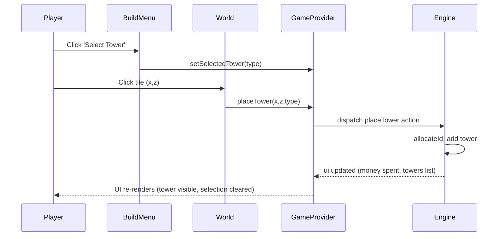
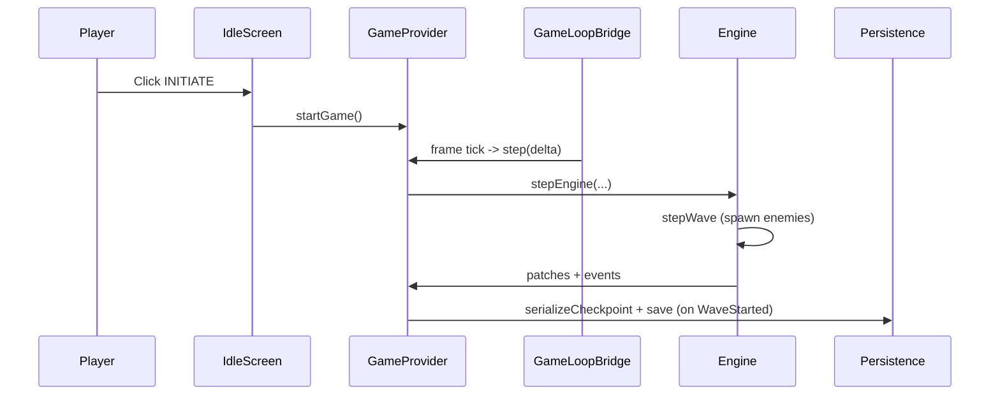
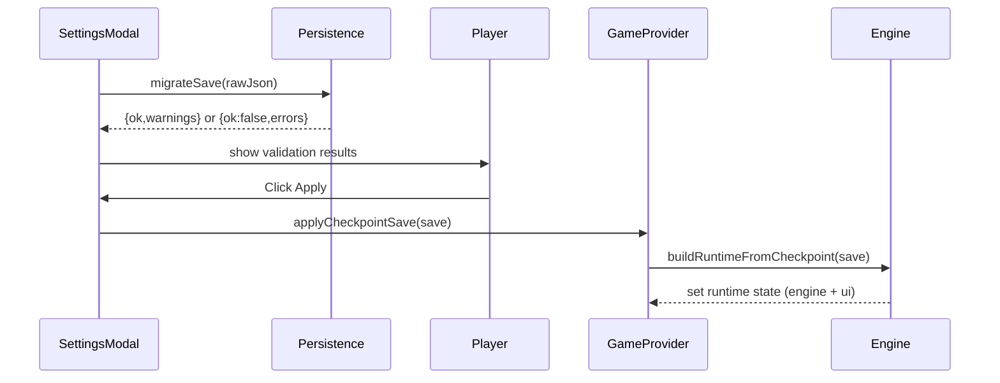

# Project Workflow Blueprint — Neon Defense 3D ✅

**Snapshot**

- **Stack:** React 19 + TypeScript + Vite, rendering with @react-three/fiber (Three.js).
- **Entry points:** Frontend UI components (no server/API). Main flows are initiated from UI overlay components (e.g., `IdleScreen`, `BuildMenu`, `SettingsModal`).
- **Persistence:** localStorage-based Tier-B checkpoints (`src/game/persistence.ts`, key `nd3d.checkpoint.v1`).
- **Architecture pattern:** Layered front-end with a clear separation between the rendering layer (R3F components in `game/components`) and the game engine/state (pure engine under `game/engine` + `GameState` provider).
- **Detail level:** Implementation-Ready (code snippets, tests, and sequence diagrams included).

---

## Contents

1. Build Tower (placement flow) 🔧
2. Start Game & Wave lifecycle (engine loop + autosave) ⏱️
3. Export / Import / Reset (persistence and migration) 💾

Each workflow includes: overview, entry point, service/engine details, data mapping, data access, error handling, async patterns, tests, sequence diagram, and a short implementation template.

---

## 1) Build Tower (Placement) 🔧

### Overview

- **Purpose:** User selects a tower and places it on a valid grid tile; cost is deducted and a tower entity is created in the engine state.
- **Trigger:** User selects a tower in the `BuildMenu` then clicks a `Tile` in the `World`.
- **Key files & components:**
  - `src/components/ui/BuildMenu.tsx` — selects tower type
  - `src/components/UI.tsx` — wires `BuildMenu` and `setSelectedTower`
  - `src/game/components/World.tsx` — `Tile` handles click/hover and calls `placeTower`
  - `src/game/GameState.tsx` — `placeTower()` and runtime reducer `placeTower` logic
  - `src/constants.ts` — `TOWER_CONFIGS` and `TowerType`
  - `src/types.ts` — `TowerEntity`, `TowerType`
  - Tests: `src/tests/components/BuildMenu.test.tsx`, `src/tests/game/gameState.test.ts`

### Entry point (frontend)

- User selects a tower via `BuildMenu`. Key snippet (simplified):

```tsx
// src/components/ui/BuildMenu.tsx
<button
  onClick={() => {
    if (isSelected) onSelectTower(null);
    else if (canAfford) onSelectTower(type);
  }}
>
  ...
</button>
```

- Clicking a grid tile triggers placement:

```tsx
// src/game/components/World.tsx
onClick={() => {
  if (gameState.gameStatus !== 'playing') return;
  const existingTower = towers.find(t => t.gridPos[0] === x && t.gridPos[1] === z);
  if (existingTower) { setSelectedEntityId(existingTower.id); return; }
  if (selectedTower) placeTower(x, z, selectedTower);
}}
```

### Service / Engine implementation

- Public API (from `GameProvider`):
  - `placeTower(x: number, z: number, type: TowerType): void`
  - `setSelectedTower(tower: TowerType | null): void`

- Core server-side logic lives in the runtime reducer (`src/game/GameState.tsx`) — key behavior:
  - Validate affordability using `TOWER_CONFIGS[type].cost`.
  - `allocateId` to assign a new unique ID.
  - Append to `engine.towers` via `applyEnginePatch`.
  - Update UI `money` via `uiReducer({ type: 'spendMoney', amount })`.

Snippet (essential):

```ts
// runtimeReducer (excerpt)
case 'placeTower': {
  const config = TOWER_CONFIGS[action.towerType];
  if (!config || state.ui.money < config.cost) return state;
  const { id, state: afterId } = allocateId(state.engine, 'tower');
  const nextTower = { id, type: action.towerType, level: 1, gridPosition: [action.x, action.z], lastFired: 0 };
  return {
    engine: applyEnginePatch(afterId, { towers: [...afterId.towers, nextTower] }),
    ui: uiReducer(state.ui, { type: 'spendMoney', amount: config.cost }),
  };
}
```

### Data mapping

- Engine towers -> UI entities via `toTowerEntity` (position mapping using `TILE_SIZE`).
- Config-driven stats from `TOWER_CONFIGS` (cost, color, name, description) and stat computation via `getTowerStats`.

### Validation & Error handling

- Placement validation: `isValidPlacement(x,z)` checks bounds, tile type (must be `TileType.Grass`), and occupancy.
- Affordability is enforced both in UI (button disabled & visual) and in reducer (defensive check).
- Tests assert invalid placements, unaffordable placements, and clearing `selectedTower` after placement.

### Testing approach

- Unit: `renderHook` / `GameProvider` tests to assert `placeTower()` behaviors (`src/tests/game/gameState.test.ts`).
- Component: `BuildMenu` rendering and affordance tests (`src/tests/components/BuildMenu.test.tsx`).
- E2E: Playwright `tests/e2e/verify_build_menu.spec.ts` verifies the flow in-browser.

### Sequence Diagram



### Implementation template (quick)

- Add enum in `src/types.ts` for new tower.
- Add config entry in `src/constants.ts` in `TOWER_CONFIGS` (cost, color, stats baseline).
- Add visuals in rendering layer (`game/components/InstancedTowers.tsx` or similar).
- Add unit tests: `gameState` (affordability/placement), component tests for `BuildMenu`, and an E2E test.

---

## 2) Start Game & Wave lifecycle ⏱️

### Overview

- **Purpose:** Transition from idle to active play; engine steps forward each rendered frame; waves are prepared, spawn enemies, progress, and complete.
- **Trigger:** `IdleScreen` `INITIATE` button → `GameProvider.startGame()` → engine reset then `GameLoopBridge` executes `step` each frame.
- **Files:**
  - `src/components/ui/IdleScreen.tsx` (User trigger)
  - `src/components/UI.tsx` (wires start flow)
  - `src/game/GameState.tsx` (`startGame()`, `step()`)
  - `src/game/components/GameLoop.tsx` (`GameLoopBridge`) — calls `step()` via `useFrame`
  - `src/game/engine/wave.ts` (wave spawning logic)
  - `src/game/engine/step.ts` (step pipeline: wave -> enemies -> towers -> projectiles)

### Entry points & core loop

- Start game (UI):

```tsx
// src/components/ui/IdleScreen.tsx
<button onClick={onStart}>INITIATE</button>;

// GameState.startGame:
const startGame = useCallback(() => {
  dispatch({ type: 'uiAction', action: { type: 'startGame' } });
  dispatch({ type: 'resetEngine' });
}, []);
```

- Loop integration: `GameLoopBridge`:

```tsx
useFrame((state, delta) => {
  if (gameState.gameStatus !== 'playing') return;
  step(delta, state.clock.elapsedTime);
});
```

- `step()` delegates to `stepEngine`, which executes a pipeline of sub-steps (wave -> enemies -> towers -> projectiles). See `src/game/engine/step.ts`.

### Wave scheduling & autosave

- Wave logic: `stepWave` manages prep, spawning, active, completed phases and emits `WaveStarted` / `WaveCompleted` events.
- Autosave: `GameState` has an effect that listens for `waveStartedNonce` and serializes + saves a checkpoint to `localStorage` once per wave start (Tier-B checkpoint). This is how Save/Import interacts with engine progress.

Snippet (autosave):

```ts
useEffect(() => {
  const nonce = runtime.ui.waveStartedNonce;
  if (nonce <= 0) return;
  if (runtime.ui.gameStatus !== 'playing') return;
  const nextSave = serializeCheckpoint(snapshot.ui, snapshot.engine);
  saveCheckpoint(nextSave);
}, [runtime.ui.waveStartedNonce, runtime.ui.gameStatus]);
```

### Testing patterns

- Simulate time advances with `result.current.step(deltaSeconds, nowSeconds)` in unit tests and assert wave state changes and autosave (see `src/tests/game/persistence.test.ts`).

### Sequence Diagram



### Implementation hints

- To add a new enemy: update `ENEMY_TYPES` in `src/constants.ts`, add appropriate attributes (hpBase, speed, abilities), and add unit tests for `stepWave`/`spawnEnemy` behaviors.
- Keep timers deterministic in tests by controlling `delta` in `step()` calls.

---

## 3) Export / Import / Reset (Persistence & Migration) 💾

### Overview

- **Purpose:** Export a checkpoint, import a checkpoint (with validation/migration), reset to last save, or factory reset game progress.
- **Trigger:** `SettingsModal` UI actions (Copy, Download, Validate/Apply import, Reset Checkpoint, Factory Reset).
- **Files:**
  - `src/components/ui/SettingsModal.tsx` (UI and validation/UX)
  - `src/game/persistence.ts` (serialize/migrate/save/load)
  - `src/game/GameState.tsx` (`applyCheckpointSave`, `resetCheckpoint`, `factoryReset`)
  - Tests: `src/tests/game/persistence.test.ts`

### Persistence model

- `SaveV1` shape (primary fields):
  - `schemaVersion: 1`
  - `timestamp: ISO string`
  - `settings: { quality }`
  - `ui: { currentMapIndex, money, lives, upgrades, ... }`
  - `checkpoint: { waveToStart, towers: [{ type, level, x, z }] }`

Example interface excerpt (from `src/game/persistence.ts`):

```ts
export interface SaveV1 {
  schemaVersion: 1;
  timestamp: string;
  settings?: { quality?: 'high' | 'low' };
  ui: { currentMapIndex: number; money: number; lives: number; upgrades: Record<string, number> };
  checkpoint: {
    waveToStart: number;
    towers: Array<{ type: string; level: number; x: number; z: number }>;
  };
}
```

### Migration & Validation

- `migrateSave(input)` performs robust sanitization: clamps numeric values, drops unknown upgrade keys/tower types, removes towers placed on unbuildable tiles, yields `warnings` and `errors`.
- `validateSave` confirms schema correctness; `SettingsModal` shows errors/warnings and blocks `Apply` until the save is `ready`.

### Storage & error handling

- `saveCheckpoint(save)` writes JSON to `localStorage` under key `nd3d.checkpoint.v1` and returns `{ok:false, error}` on exceptions (quota issues).
- `loadCheckpoint()` returns `null` for invalid JSON or failed migrations.
- `clearCheckpoint()` removes the key; `factoryReset()` clears and resets game state.

### Testing approach

- Unit tests for `migrateSave` to validate detection/dropping of invalid items and to verify warnings (`src/tests/game/persistence.test.ts`).
- Test `saveCheckpoint` failure by mocking `localStorage.setItem` to throw.
- Integrate import flow in component tests for `SettingsModal` (validate UI error/warning rendering).

### Sequence Diagram



---

## Cross-cutting Notes & Conventions 🔧

- **Naming:** `GameProvider` methods are action-oriented (`placeTower`, `startGame`, `resetCheckpoint`). Engine files live under `src/game/engine/*` with `step`, `wave`, `tower`, `projectile` responsibilities.
- **State separation:** Rendering components read entities (e.g., `towers`, `enemies`) from `GameState` and do not mutate engine state directly — mutations are through `GameProvider` actions.
- **Testing:** Use `renderHook` + `GameProvider` for engine logic tests, `@testing-library/react` for components, and Playwright for e2e.
- **Common pitfalls:**
  - Don’t rely on UI-only checks for affordability — reducer also validates cost (defensive programming).
  - Remember `StrictMode` double-run effects when relying on counters (autosave dedupe is implemented).
  - Validate imports (don’t assume JSON is well-formed).

---

## Quick Implementation Checklist (How to add a new, similar feature)

1. Write 2–3 EARS-style requirements: WHEN <event>, THE SYSTEM SHALL <behavior> [Acceptance].
2. Add domain types (`src/types.ts`) and config entries (`src/constants.ts`).
3. Add engine changes under `src/game/engine` with tests for correctness.
4. Expose a `GameProvider` action (small, focused) and unit-test the provider.
5. Add UI (component + component tests) and a minimal e2e test if user-visible.
6. Add documentation to `docs/` and a quick test matrix for edge cases.

---

## Where I saved this & next steps ✅

- File created at: `docs/workflows.md` (this file).
- Suggested follow-ups:
  - Add a short checklist and link to this doc in the PR template.
  - Optionally add Mermaid sequence diagrams as images in docs or generate SVGs for PR review.

---

If you'd like, I can now:

- Open a PR with this doc + a summary and tests to validate the documentation's examples, or
- Generate additional diagrams or a condensed README section for `docs/`.

Would you like me to proceed with any of the follow-ups? ✨
